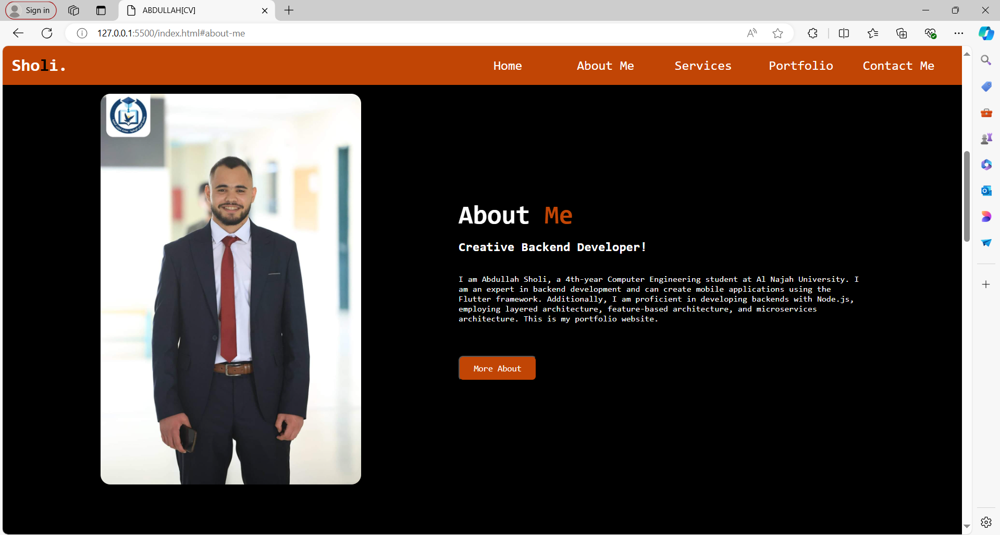
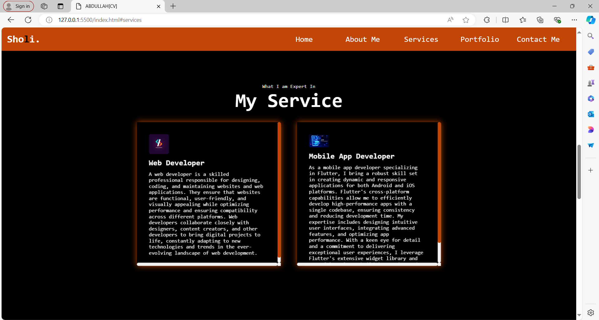
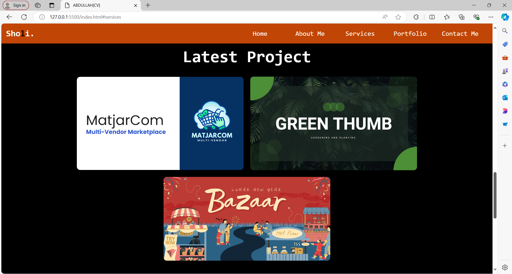
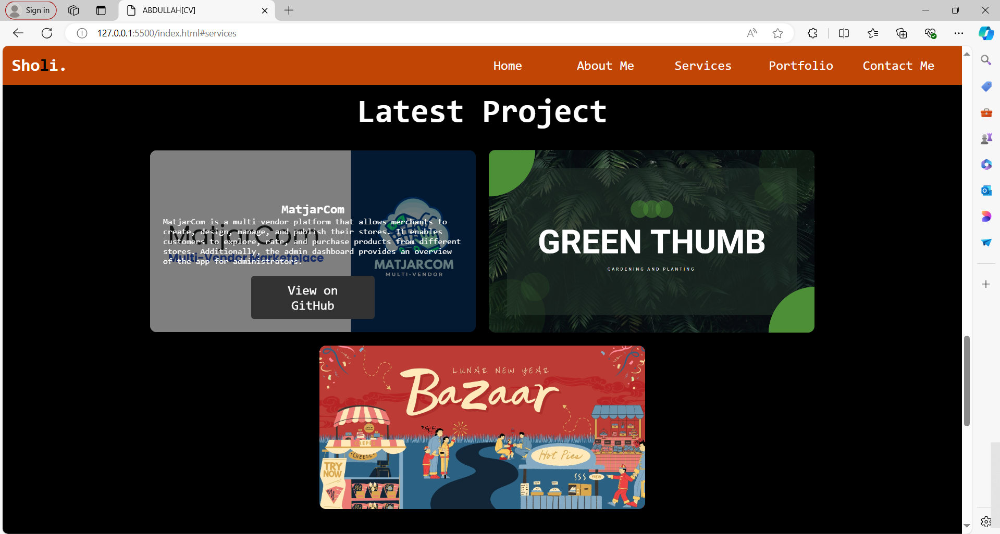
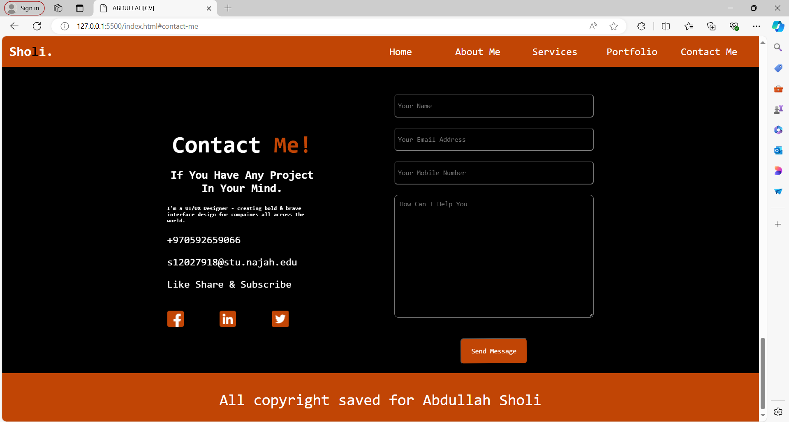

# portfolio_project_css

<h1 align="left">The appearance of my project</h1>

<h1 align="left">Hey 👋 What's up?</h1>

###

My name is Abdullah Sholi and I'm a Computer Engineer, from Palestine

###

<h2 align="left">About me</h2>

###

✨ Creating bugs since ... 📚 I'm currently learning ... 🎯 Goals: ... 🎲 Fun fact: ...

###

<h2 align="left">I code with</h2>

###

  
  
  
  
  
  
  

  

  

  
  
  
  

  
  
  
  

###
